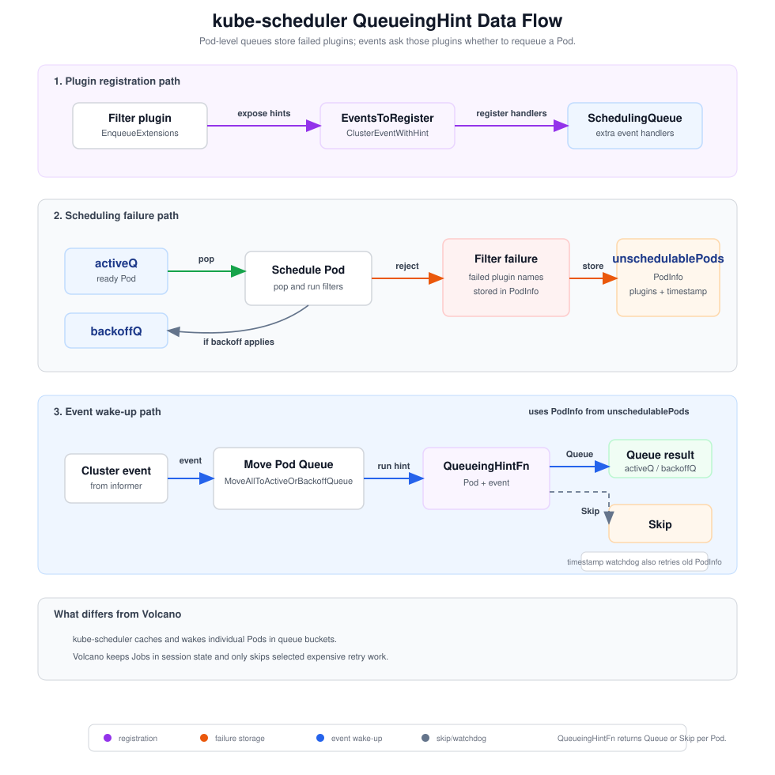
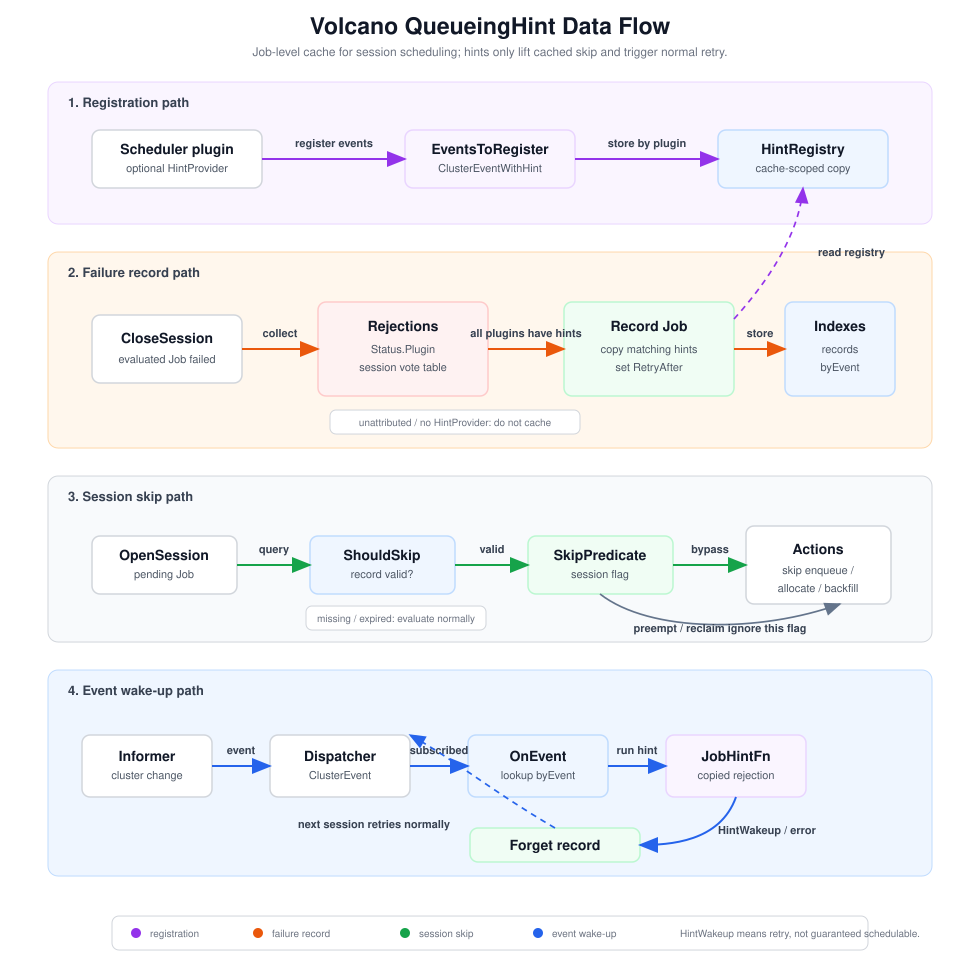
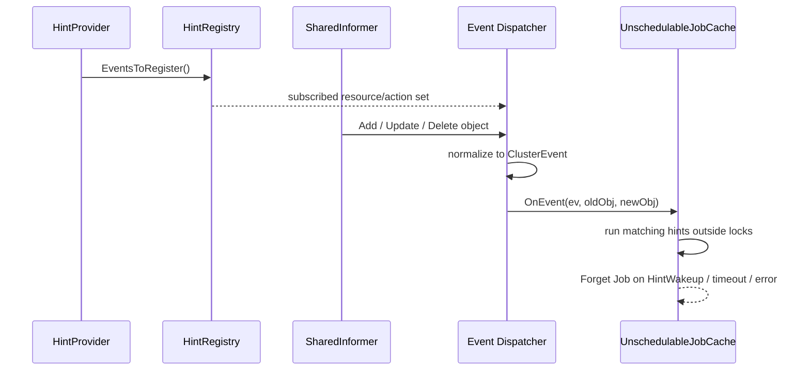
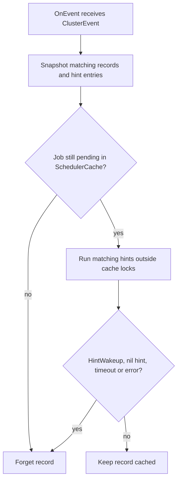
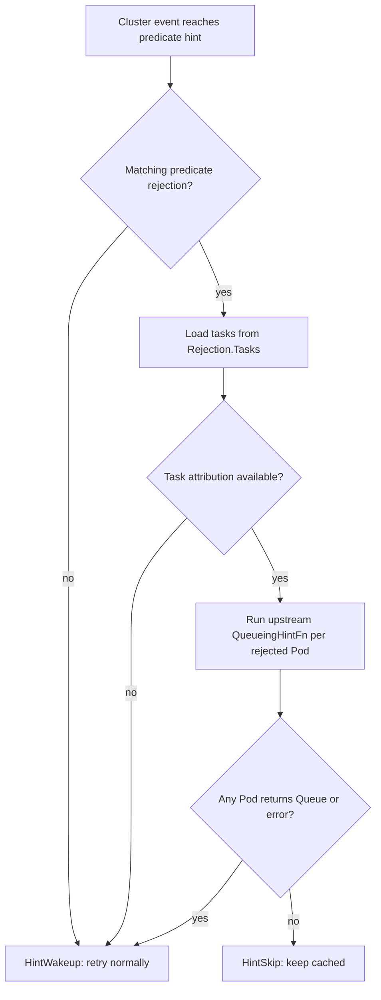

# Queueing Hint for Volcano Scheduler

<!-- toc -->
- [Summary](#summary)
- [Motivation](#motivation)
  - [Goals](#goals)
  - [Non-Goals](#non-goals)
- [Proposal](#proposal)
  - [User Stories](#user-stories)
  - [Architecture](#architecture)
- [Design Details](#design-details)
  - [1. Plugin Extension Point](#1-plugin-extension-point)
  - [2. Failure Attribution](#2-failure-attribution)
  - [3. UnschedulableJobCache](#3-unschedulablejobcache)
  - [4. Event Dispatch](#4-event-dispatch)
  - [5. Scheduler Action Changes](#5-scheduler-action-changes)
  - [6. kube-scheduler QueueingHint Adapter](#6-kube-scheduler-queueinghint-adapter)
  - [7. Initial Plugin Coverage](#7-initial-plugin-coverage)
- [Risks and Mitigations](#risks-and-mitigations)
- [Alternatives Considered](#alternatives-considered)
- [Test Plan](#test-plan)
- [Related Issues](#related-issues)
<!-- /toc -->

## Summary

Introduce a plugin extension point that allows Volcano to avoid redundantly retrying
unschedulable Jobs during every scheduling session when cluster state remains unchanged.
By recording which plugins blocked a Job, Volcano can skip its expensive filter code path 
unless an informer event occurs that those specific blocking plugins subscribe to as a potential 
wake-up signal.

Unlike Kubernetes' default scheduler, this design respects Volcano's session-based scheduling model 
and does not introduce a per-Pod active/backoff/unschedulable queue structure. Instead, the 
integrated `predicates` plugin delegates events directly to adapted `QueueingHint` callbacks from 
the wrapped in-tree Kubernetes filter plugins.

## Motivation

Volcano runs a periodic scheduling loop, initiating a new session every `--schedule-period` 
(defaulting to `1s` in [`cmd/scheduler/app/options/options.go`](../../cmd/scheduler/app/options/options.go)).
Each session snapshots cluster state and re-evaluates all pending Jobs across enabled scheduling 
actions (e.g., `enqueue`, `allocate`, `backfill`). Resource and predicate failures are captured 
inside session-local structures like `JobInfo.JobFitErrors` and `JobInfo.NodesFitErrors` 
([`pkg/scheduler/api/job_info.go`](../../pkg/scheduler/api/job_info.go)), which are completely 
discarded when the session finishes.

In large-scale clusters with thousands of pending Pods, actions like `allocate` spend significant 
CPU cycles repeatedly running expensive pre-filters (`PrePredicateFn`) and node-by-node checks 
(`PredicateNodes`) for Jobs whose blocking conditions have not changed. This overhead dramatically 
inflates scheduling cycle latencies (`actionSchedulingLatency{action="allocate"}`) and starves 
newly submitted, actually schedulable workloads. For details, see issue tracking performance 
bottlenecks in [#5494](https://github.com/volcano-sh/volcano/issues/5494) and 
[#5551](https://github.com/volcano-sh/volcano/issues/5551).

While `kube-scheduler` addresses this via per-plugin `QueueingHint` callbacks nested inside its 
scheduling queue, Volcano requires a session-native counterpart that reuses the event filtration 
logic without inheriting the Pod-by-Pod active/inactive queue lifecycle.

### Goals

- **Failure Tracking**: Accurately attribute and persist which plugins made a Job unschedulable in a session.
- **Selective Bypassing**: Skip expensive filter-stage computations for unschedulable Jobs until a relevant progress event is dispatched.
- **Upstream Reuse**: Seamlessly adapt and reuse existing `kube-scheduler` in-tree `QueueingHint` implementations inside the `predicates` plugin.
- **Fairness Preservation**: Keep skipped Jobs visible to the larger scheduler session flows (DRF, proportion, capacity, and gang constraints) to prevent accounting or ordering drift.

### Non-Goals

- Implementing a multi-tier active/backoff/unschedulable queuing model inside Volcano.
- Persisting unschedulable cache state across Volcano scheduler restarts.
- Supporting hint-driven wake-ups for opaque extender failures (`extender` has no `HintProvider`; Jobs it rejects are re-evaluated every session).
- Mandating queueing-hint overrides for every single plugin in the first release.

## Proposal

This design introduces a high-performance event-driven retry mechanism tailored to 
Volcano's scheduling architecture.

### User Stories

- **Queue Resource Recovery**: A queue runs out of capacity. Hundreds of corresponding `PodGroups` 
  fail during the `capacity` or `proportion` checks. Volcano caches these Jobs and skips their 
  scheduling logic in subsequent sessions, waking them up immediately only when queue limits are relaxed, 
  or another Job in that queue finishes.
- **Node Attribute Fit**: A Job requires a distinct node label that is presently missing in the cluster. 
  Instead of evaluating it every second across all cluster nodes, Volcano bypasses its filter phase, 
  retrying it only when a new node is registered (`Node/Add`) or an existing node's labels are edited 
  (`Node/UpdateNodeLabel`).
- **Gang Scheduling Constraints**: A gang Job cannot satisfy its `minAvailable` constraint. Volcano 
  temporarily suspends its scheduling attempts, waking it up only when more tasks of this Job finish, 
  new nodes capacity becomes available, or the `PodGroup` spec is updated.
- **Legacy Fallback**: A custom scheduler plugin is registered without Queueing Hint support. Any Job
  failure tied to this plugin causes the Job to be left out of the unschedulable cache, so Volcano
  falls back to traditional, unconditional session-by-session evaluation for that Job.

### Architecture

The upstream kube-scheduler workflow is useful as the reference model:



Key points:

1. Filter plugins implement `EnqueueExtensions` and register `ClusterEventWithHint`
    callbacks.
2. The scheduling queue stores failed Pods in `unschedulablePods` together with the
    plugins that rejected them and the timestamp when they became unschedulable.
3. Extra informer handlers receive subscribed cluster events, run the failed plugins'
    `QueueingHintFn`s, and move matching Pods back to `activeQ` or `backoffQ`.
4. A periodic watchdog also moves Pods out of `unschedulablePods` when they stay there
    longer than the default maximum duration.

Volcano keeps the same core idea — plugin-specific event hints wake only the workloads
blocked by those plugins — but maps it to session-based scheduling and Job-level state:



1. During `OpenSession`, plugins call `AddHintProvider`; the cache stores their
    `ClusterEventWithHint` declarations in `HintRegistry`.
2. During `CloseSession`, Volcano collects the plugins that rejected each pending Job
    and records the Job in `UnschedulableJobCache` with copied hint subscriptions.
3. Informer dispatchers normalize cluster changes into `ClusterEvent`s and call
    `UnschedulableJobCache.OnEvent`.
4. A matching hint, timeout, error, PodGroup change, or `RetryAfter` expiry removes
    the record so the next session retries the Job.
5. Until then, `OpenSession` marks the Job with `SkipPredicate`; `enqueue`, `allocate`
    and `backfill` skip normal retry work, while `preempt` and `reclaim` still evaluate
    the Job normally.

To avoid memory leaks and hard-lock states arising from plugin callback edge cases, the
`UnschedulableJobCache` operates independently of individual session Lifecycles and
uses a timestamp-based watchdog retry.

## Design Details

### 1. Plugin Extension Point

A `HintProvider` is an optional interface a plugin implements to declare, in one place, the
cluster events that could invalidate its previous unschedulable verdicts. Each declaration
is a `ClusterEventWithHint`: a `(ClusterEvent, JobHintFn)` pair where `ClusterEvent` names the change
to watch and `JobHintFn` decides, per Job, whether that particular occurrence is worth a
retry. A `nil` `JobHintFn` means "any occurrence wakes the Job".

```go
type ClusterEvent struct {
    // Resource is the object type whose change may affect scheduling, such as
    // Node, Pod, PVC/PV, StorageClass, CSINode, PodGroup, Queue, HyperNode or
    // NumaInfo.
    Resource   EventResource

    // ActionType describes the kind of change. Besides generic Add/Update/Delete,
    // node events are split into label, taint, allocatable and condition updates.
    ActionType ActionType
}

// JobHintFn is evaluated for an unschedulable Job when one of the plugin's subscribed
// events arrives. The Rejection is the plugin's own rejection from the previous
// session, including the task IDs it rejected when the source is Predicate.
//
// oldObj and newObj are the objects observed by the informer event. Add events
// pass only newObj, delete events pass only oldObj, and update events pass both.
// Returning an error is handled as HintWakeup by the caller, so a broken hint
// cannot keep a Job in the cache indefinitely.
//
// Example: a NodeAffinity hint registered for Node/UpdateNodeLabel compares the
// old and new node labels with the Job's node selector. It returns HintWakeup
// only when the new labels may satisfy the selector.
type JobHintFn func(
    logger klog.Logger,
    job *JobInfo,
    rejection Rejection,
    oldObj, newObj any,
) (HintResult, error)

type HintResult int

const (
    HintSkip HintResult = iota
    HintWakeup
)

// ClusterEventWithHint pairs one cluster event a plugin cares about with the
// callback used to check whether that event may help a specific Job. Mirrors
// kube-scheduler's fwk.ClusterEventWithHint. A nil HintFn means every occurrence
// of Event may wake Jobs blocked by this plugin.
type ClusterEventWithHint struct {
    Event  ClusterEvent
    HintFn JobHintFn
}

// HintProvider lets a plugin declare the events that can change its previous
// unschedulable decisions. The method name mirrors kube-scheduler's
// fwk.EnqueueExtensions.EventsToRegister.
type HintProvider interface {
    EventsToRegister(ctx context.Context) ([]ClusterEventWithHint, error)
}
```

Plugins register during `OpenSession`:

```go
func (ssn *Session) AddHintProvider(pluginName string, p HintProvider)
```

Plugin objects are session-scoped, but the informer handlers and `UnschedulableJobCache`
run at scheduler-cache scope and keep firing after the session ends. `AddHintProvider`
bridges that lifetime gap by forwarding the plugin's `ClusterEventWithHint`s into a
cache-owned `HintRegistry` that lives next to `BinderRegistry` in
`pkg/scheduler/cache/factory.go` — the same pattern Volcano already uses for `PreBinder`:

```go
// pkg/scheduler/cache/factory.go

type HintRegistry struct {
    mu       sync.RWMutex
    eventsByPlugin map[string][]ClusterEventWithHint
}

func (r *HintRegistry) Register(name string, p HintProvider) { /* ... */ }
```

`Register` calls `EventsToRegister(ctx)` once and overwrites any previous entry for the
same plugin, matching `BinderRegistry`'s replacement semantics. Keeping the two
registries as siblings (rather than folding them into one type-switched bag) preserves
per-extension registration semantics and gives the cache a single, obvious home for
every session-to-cache extension point.

`HintRegistry` is the only hand-off from session-scoped plugins to cache-scoped
dispatch: §3 covers how `Record` copies from it at `CloseSession`, and §4 covers how
informer handlers reach the cache through it.

### 2. Failure Attribution

Every unschedulable Job the cache tracks carries a list of **rejections**: one entry
per plugin that rejected the Job in the just-closed session, together with the
extension point where the rejection happened. Rejections are the only input `Record`
(§3) needs to pick hint subscriptions, and the only signal §5 uses to decide which
action stages a skipped Job may bypass.

```go
// Rejection describes one plugin decision that made a Job unschedulable in a session.
type Rejection struct {
    // Plugin is the registered HintProvider name that produced the decision. For
    // the predicates plugin this is the per-filter suffix such as
    // "predicates/nodeaffinity", so Record picks the exact hint list that applies
    // to the failed filter instead of copying every hint the predicates plugin owns.
    Plugin string

    // Source is the extension point that emitted the rejection. Used by action
    // bypass logic (§5).
    Source RejectionSource

    // Tasks holds the task IDs a rejection needs for per-task hint replay. Only
    // predicate rejections set it today: the §6 adapter runs the upstream per-Pod
    // QueueingHintFn for each failed task. Job-level hints leave it empty.
    Tasks []TaskID
}

type RejectionSource string

const (
    RejectionPredicate   RejectionSource = "predicate"   // PredicateFn / PrePredicateFn
    RejectionAllocatable RejectionSource = "allocatable" // Allocatable
    RejectionEnqueue     RejectionSource = "enqueue"     // JobEnqueueable
    RejectionJobReady    RejectionSource = "job_ready"   // JobReady / SubJobReady
)
```

Each rejection is tagged with the extension point that produced it. The source tells
§5 which action stage may later bypass the Job, and tells the §6 adapter whether the
rejection must carry the failed task IDs.

| Extension point | RejectionSource | Records `Tasks`? | Typical plugins |
|---|---|---|---|
| `PredicateFn` / `PrePredicateFn` | `RejectionPredicate` | Yes | `predicates/*` |
| `Allocatable` | `RejectionAllocatable` | Not today | `capacity`, `proportion` |
| `JobEnqueueable` | `RejectionEnqueue` | No (Job-level) | `capacity`, `proportion`, `overcommit` |
| `JobReady` / `SubJobReady` | `RejectionJobReady` | No (Job-level) | `gang` |

`Tasks` is populated only when a plugin's hint actually consumes per-task information,
not simply because the extension point is invoked per task. The §6 predicate adapter
replays the upstream per-Pod `QueueingHintFn`, so it always needs the task IDs that
failed each filter. `Allocatable` is also called per task, but the native `capacity` /
`proportion` hint today decides at queue granularity ("did this queue's quota grow?"),
so it does not consume the task list — a future capacity hint that wants to match freed
quota against specific task requests can start recording `Tasks` with no structural
change. `JobEnqueueable` and `JobReady` are genuinely Job-level and never carry tasks.

`RejectionJobReady` is the `gang` plugin's rejection: the Job could not gather
`minAvailable` schedulable tasks this session. It is woken by events that add
schedulable capacity — `Node/Add`, `Node/UpdateNodeAllocatable`, or `Pod/Delete` when a
task finishes and frees resources — which is exactly what `gang` registers as a
`HintProvider`.

At `CloseSession` Volcano gathers each pending Job's rejections into one list. A
rejection is only actionable if its plugin is a `HintProvider`: if any rejecting plugin
has no registered hints (or a predicate error carries no plugin name), no cluster event
could ever wake the Job for that failure, so the Job is left out of the cache and keeps
going through the normal filter path every session — matching today's behavior.

### 3. UnschedulableJobCache

`UnschedulableJobCache` lives on `SchedulerCache`. It records unschedulable Jobs by
`JobID`, together with the rejection list collected at `CloseSession` and the hint
callbacks copied from `HintRegistry`.

The normal retry lifecycle is:

1. `CloseSession` calls `Record(job, rejections)` for Jobs that were evaluated and
   still failed.
2. The next `OpenSession` calls `ShouldSkip(job)` for each pending Job.
3. If `ShouldSkip` returns true, `enqueue`, `allocate` and `backfill` leave the Job
   pending and skip the expensive predicate path for this session.
4. A matching informer event calls `OnEvent`; if a hint says the Job may need retry,
   the cache calls `Forget(job.UID)` and the next session evaluates it normally.
5. If no relevant event arrives before `RetryAfter`, `ShouldSkip` returns false once
   and the Job is retried by the normal actions.

Recovery actions (`preempt` and `reclaim`) do not use `ShouldSkip`. They scan pending
Jobs from `ssn.Jobs` normally because Volcano cannot know in advance which Job may
become schedulable after victims are selected. When they pipeline a Job's tasks onto
victims, that Job is progressing through preemption rather than being unschedulable, so
`CloseSession` drops any existing record and does not re-cache it while it has pipelined
tasks (see §5).

**Interface.**

```go
type UnschedulableJobCache interface {
    // Record inserts (or replaces) the Job with the rejections observed at
    // CloseSession and copies the matching hint callbacks out of sc.hintRegistry.
    // Returns without inserting if any rejection's plugin has no HintProvider
    // (see §2 fallback).
    Record(job *api.JobInfo, rejections []Rejection)

    // ShouldSkip is called during OpenSession. It returns true when normal retry
    // work can be skipped for this Job in enqueue/allocate/backfill. The returned
    // rejections are copied to JobInfo.SkipReason.
    ShouldSkip(job *api.JobInfo) (bool, []Rejection)

    // Forget drops the record.
    Forget(jobID api.JobID)

    // OnEvent is invoked by the informer dispatchers wired in §4. It runs the
    // hints subscribed to `ev` and Forgets any Job whose hint returns HintWakeup.
    OnEvent(ev ClusterEvent, oldObj, newObj any)
}
```

**Record.**

```go
type UnschedulableRecord struct {
    JobID      api.JobID
    Rejections []Rejection // §2; retained for §5 bypass rules

    LastFailedAt time.Time
    RetryAfter   time.Time  // LastFailedAt + DefaultMaxSkipDuration

    // Subscriptions is the per-Job routing table, copied from sc.hintRegistry
    // at Record time. OnEvent walks this map — never the live registry — so a
    // plugin registered in a later session cannot silently change how old
    // records wake up.
    Subscriptions map[ClusterEvent][]hintEntry
}

type hintEntry struct {
    Plugin    string
    Rejection Rejection
    Fn        JobHintFn
}
```

The cache indexes records two ways: `records map[JobID]*UnschedulableRecord` for
direct lookup, and `byEvent map[ClusterEvent]sets.Set[JobID]` (plus a `wildcard` set
for records with a nil `HintFn`) as a reverse index for `OnEvent`.

**Cache updates.**

| Call site | Cache call | Meaning |
|---|---|---|
| `CloseSession`, evaluated Job still pending | `Record(job, rejections)` | Store or replace the record and rebuild event subscriptions. |
| `OpenSession`, pending Job | `ShouldSkip(job)` | Decide whether normal retry work can be skipped. |
| `CloseSession`, Job became allocated | `Forget(job.UID)` | Remove the record. |
| PodGroup update/delete informer | `Forget(jobID)` | Job spec/lifecycle changed; evaluate it again. |
| Queueing-hint informer event | `OnEvent(ev, oldObj, newObj)` | Run matching hints and wake Jobs that may need retry. |

`ShouldSkip(job)` returns false when there is no record or `now >= RetryAfter`. In
that case the normal actions evaluate the Job again; if it still fails, `Record`
refreshes the cache at `CloseSession`.

There is no per-Job timer and no exponential backoff. Each record stores a timestamp,
and Volcano checks it while it already walks pending Jobs in `OpenSession`. This gives
the same watchdog semantics as a periodic cache scan: if a Job stays cached longer
than the maximum skip duration, the next scan lets it retry once. Events remain the
normal wake-up path; the timestamp is only a safety net for missed hints, broken
attribution, or informer edge cases.

**Invalidation.** A record is removed or bypassed by these triggers:

| Trigger | Effect |
|---|---|
| A subscribed cluster event whose hint returns `HintWakeup`, times out, or errors | `Forget` (via `OnEvent`) |
| `PodGroup Update` / `Delete` | `Forget` (from the cache's informer handler) |
| `now >= RetryAfter` | `ShouldSkip` returns false; the session re-evaluates the Job |

`Record` sets retry timing like this:

```
LastFailedAt = now
RetryAfter   = now + DefaultMaxSkipDuration // 5m
```

`OnEvent` is described in §4 together with the informer dispatch path.

### 4. Event Dispatch

The dispatch layer wires cluster events to `UnschedulableJobCache`. It has three
concerns: (a) telling the cache which events any plugin actually cares about, (b)
attaching handlers to the corresponding informers, and (c) delivering each event to
the affected records.

**Subscribed event set.** After each `OpenSession`, the cache derives the union of
subscribed `(resource, action)` pairs from `HintRegistry`. Only matching events are
forwarded to queueing-hint dispatch. If no plugin subscribes to
`Node/UpdateNodeTaint`, a taint-only node update does not run queueing-hint logic.

**Handler registration.** Volcano installs a queueing-hint dispatcher beside the
existing cache-update handlers for subscribed resources. Each dispatcher normalizes
the informer callback into a `ClusterEvent`, filters unsupported action types, and
then calls `UnschedulableJobCache.OnEvent`.



Node updates are split into finer action types such as `UpdateNodeLabel`,
`UpdateNodeTaint`, `UpdateNodeAllocatable` and `UpdateNodeCondition`; other resources
use generic `Update`. This is what prevents, for example, a taint-only change from
waking Jobs blocked only by node labels.

**Dispatch mode.** The default path runs `OnEvent` synchronously on the informer
callback. The cache snapshots candidate records under lock, releases the lock, and
then runs bounded hint callbacks. A timeout, panic or error is treated as
`HintWakeup`, so a broken hint cannot keep a Job cached indefinitely. If benchmarks
show a specific event source is too hot, that resource can be moved behind a bounded
worker without changing the `OnEvent` contract.

**`OnEvent` behavior**:



Any subscribed plugin can wake the Job. The next scheduling session still performs the
normal Volcano checks; the hint only decides whether the cached skip should be lifted.

### 5. Scheduler Action Changes

Queueing hints only take effect if scheduling actions actually short-circuit on cached
Jobs. This section walks the session lifecycle and specifies which extension points each
action skips.

`OpenSession` still builds the session normally. After plugins register callbacks and
hint providers, Volcano checks each pending Job against `UnschedulableJobCache` and
stores the result on a transient session field:

```go
type JobInfo struct {
    // existing fields omitted
    SkipPredicate bool
    SkipReason    string
}
```

This is intentionally not a snapshot-level filter. Skipped Jobs stay in `ssn.Jobs` and in
every action's task queue so DRF, capacity, proportion and gang accounting see the full
pending demand. `SkipPredicate` only gates normal retry work in `enqueue`, `allocate`
and `backfill`; recovery actions ignore it.

Action behavior:

| Stage | Behavior when `SkipPredicate=true` |
|---|---|
| `enqueue` | Skip enqueue plugin re-vote only when the cached rejection came from `RejectionEnqueue`. |
| `allocate` / `backfill` | Keep the Job in the action queue, but skip pre-predicate, predicate and scoring work for its tasks. |
| `preempt` / `reclaim` | Ignore `SkipPredicate` and evaluate pending Jobs normally. If they pipeline a Job's tasks onto victims, that Job is treated as in-progress and kept out of the unschedulable cache. |

The cache reconciles against the session outcome at `CloseSession`:

| Job outcome | Cache action |
|---|---|
| Allocated this session | Forget the record. |
| Has pipelined tasks after `preempt` / `reclaim` | Forget / do not record — preemption is in progress. |
| Skipped this session (`SkipPredicate`) | Keep the existing record unchanged. |
| Evaluated, still pending, produced rejections | Record (replace) the Job. |

A Job whose tasks were pipelined by `preempt` or `reclaim` is deliberately kept out of
the cache. Its victims are still being evicted, so the next `allocate` may keep
rejecting those tasks until their resources are actually freed — and caching the Job as
unschedulable would suppress exactly the retries that let the preemption finish.
Otherwise `Record` runs only when the session actually evaluated the Job and produced
fresh rejections; a skipped Job keeps its record until an event wakes it, the Job
changes, or `RetryAfter` lets it retry once.

### 6. kube-scheduler QueueingHint Adapter

The `predicates` plugin wraps these kube-scheduler in-tree filter plugins:

- `nodeunschedulable`
- `nodeaffinity`
- `nodeports`
- `tainttoleration`
- `interpodaffinity`
- `nodevolumelimits.CSILimits`
- `volumezone`
- `podtopologyspread`
- `vbcap.VolumeBinding`
- `dynamicresources.DynamicResources`

All of these implement `fwk.EnqueueExtensions`. Both the return type of
`EventsToRegister(ctx) ([]fwk.ClusterEventWithHint, error)` and its `QueueingHintFn`
field are exported, so Volcano can invoke the upstream hints directly without
reimplementing them.

The `predicates` plugin publishes one `ClusterEventWithHint` per upstream event and
tags each with a stable plugin name (`predicates/<filter>`). `Record` uses that name
to copy only the hints that match the filters that actually rejected the Job.

The upstream hint operates on a single Pod, while Volcano caches at Job granularity.
`HintWakeup` in the adapter therefore does **not** mean "the whole Job is now
schedulable". It only means "this event may have changed at least one predicate
failure from the previous session, so Volcano should run the normal Job evaluation
again".

`wrapPodHint` bridges the granularity gap by using the `Rejection.Tasks` captured in
§2. It calls the upstream `QueueingHintFn` only for Pods that actually failed the same
filter in the previous session, and wakes the Job if any one of those Pods is worth
retrying.



This favors correctness over aggressive skipping. If the cache has no task-level
predicate attribution, the adapter wakes the Job and lets the next session evaluate it
normally rather than guessing from an arbitrary representative Pod.

### 7. Initial Plugin Coverage

| Plugin | Category | Event source | Notes |
|---|---|---|---|
| `predicates/nodeaffinity`, `predicates/nodeports` | NodeAffinity | adapter | `Node/Add`, `Node/UpdateNodeLabel` |
| `predicates/tainttoleration`, `predicates/nodeunschedulable` | Taint | adapter | `Node/Add`, `Node/UpdateNodeTaint` |
| `predicates/interpodaffinity`, `predicates/podtopologyspread` | PodTopology | adapter | `Pod/Add`, `Pod/Delete`, `Node/UpdateNodeLabel` |
| `predicates/nodevolumelimits`, `predicates/volumezone`, `predicates/volumebinding` | Storage | adapter | PVC/PV/StorageClass/CSINode events |
| `predicates/dynamicresources` | Device | adapter | ResourceClaim/DeviceClass/Node allocatable events |
| `gang` | Gang | native | PodGroup, Pod and Node events |
| `capacity`, `proportion`, `overcommit` | Queue | native | Queue, PodGroup completion/deletion, Pod deletion |
| `numaaware` | NUMA | native | NumaInfo, Node add |
| `deviceshare` | Device | native | Node allocatable, PodGroup deletion |
| `network-topology-aware` | HyperNode | native | HyperNode, node label events |
| `resource-strategy-fit` | Resource | native | Node add/allocatable, Pod deletion |
| `extender` | — | none | no `HintProvider`; Jobs it rejects are not cached, so they fall back to per-session retry |
| any plugin without `HintProvider` | — | none | same fallback |

## Risks and Mitigations

| Risk | Mitigation |
|---|---|
| A hint misses a relevant event. | Fail open on errors/timeouts, `RetryAfter` watchdog, unattributed failures skip caching entirely (Job goes through the normal filter path). |
| Wrong plugin attribution. | Populate `Status.Plugin` in session wrappers; unit tests for `PredicateFn`, `PrePredicateFn`, `JobEnqueueable`, `JobReady`. |
| Cache uses stale plugin registrations. | Registrations are copied into records. Later registrations apply only to new records; old records are bounded by the watchdog. |
| Fairness drift. | Jobs stay in `ssn.Jobs`; only selected expensive checks are skipped. |
| Hot `Pod` event path. | Event index by per-rejection subscription; callbacks outside lock; per-callback timeout. |
| Extender behavior unknown. | Jobs rejected by the extender are not cached; they are re-evaluated every session, matching today's behavior. |
| Preemption progress suppressed. | Jobs with pipelined tasks are excluded from the cache, so `preempt` / `reclaim` retries are never skipped. |

## Alternatives Considered

- **Require all blocking plugins to return `HintWakeup`.** Rejected. It needs extra per-plugin wake state and can leave Jobs cached until watchdog retry.
- **Push a global plugin hint registry into `SchedulerCache`.** Adopted, with per-record copying. `Record` copies only the current rejections' hints so old records are not affected by later plugin registrations or session teardown.
- **Drop unschedulable Jobs from `ssn.Jobs`.** Rejected. DRF, capacity and proportion need to see pending demand.
- **Persist records in PodGroup status or annotations.** Rejected. Adds API-server writes and races with user updates.
- **Reimplement kube-scheduler hints in Volcano.** Rejected. The upstream callback API is public and already captures plugin-specific logic.
- **Task-granularity cache records.** Deferred. Job-level records match gang semantics and are much smaller than Pod-level records.

## Test Plan

**Unit**

- `HintRegistry`: successful registration, registration error propagates to caller,
  duplicate plugin replacement, session-local lifetime.
- Failure attribution: `Status.Plugin` filled by `PredicateFn`/`PrePredicateFn` wrappers;
  bool extension points populate `jobRejections`; unattributed errors and rejections
  from plugins without a `HintProvider` cause the Job to be skipped from caching.
- `UnschedulableJobCache`: `Record`, index creation, `ShouldSkip`, `RetryAfter` expiry, PodGroup update/delete invalidation, `OnEvent`, timeout/error fail-open, wildcard, concurrent event and record.
- `predicates` adapter: event mapping and per-Pod-to-per-Job aggregation.

**Integration**

- Session open with existing records sets `SkipPredicate`.
- Session close records rejections from `NodesFitErrors` and `jobRejections`.
- Skipped Jobs remain in `ssn.Jobs` and fairness plugin outputs match the baseline.
- `preempt` and `reclaim` still evaluate Jobs with `SkipPredicate=true`.
- A Job whose tasks are pipelined by `preempt` / `reclaim` is not recorded, and any
  existing record is dropped.

**Benchmarks**

- `benchmark/testcases/queueing-hint/`: 5,000 pending PodGroups with mixed rejections. Compare allocate latency, session duration, bind throughput and cache memory before and after queueing-hint is enabled.

**E2E**

- Node label mismatch wakes only on node label/add events.
- Queue capacity failure wakes only on queue/PodGroup/Pod events.
- A Job blocked by two plugins wakes when either plugin's hint returns `HintWakeup`, then
  re-records with the remaining rejection if it still fails.

## Related Issues

- [#5551 Reduce repeated scheduling attempts for unchanged unschedulable jobs](https://github.com/volcano-sh/volcano/issues/5551)
- [#5494 [Umbrella] Track Volcano performance and scalability work](https://github.com/volcano-sh/volcano/issues/5494)
- [#5537 Explore signature-based batching for homogeneous gang workloads](https://github.com/volcano-sh/volcano/issues/5537)
- Upstream: [KEP-4247 QueueingHint](https://kep.k8s.io/4247)
